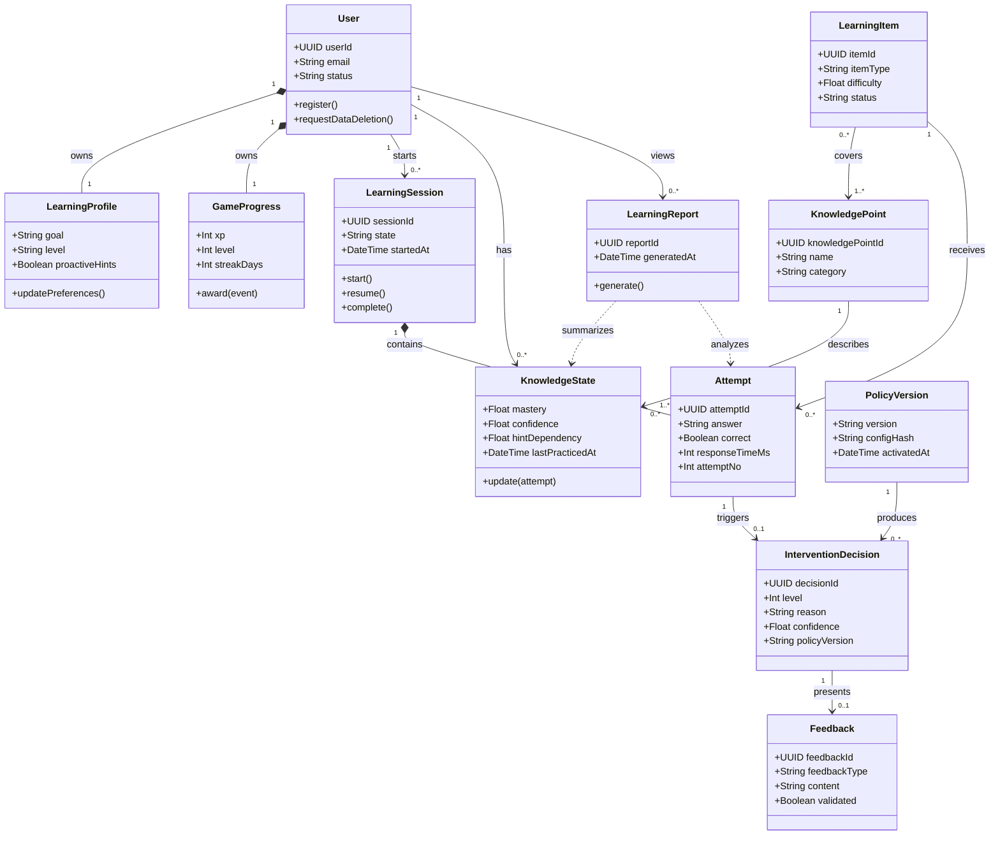

# OwlOWLGo 领域模型

该类图展示学习者、学习内容、作答、知识状态、干预决策、反馈、游戏进度和学习报告之间的核心关系。

```mermaid
classDiagram
    class User {
        +UUID userId
        +String email
        +String status
        +register()
        +requestDataDeletion()
    }
    class LearningProfile {
        +String goal
        +String level
        +Boolean proactiveHints
        +updatePreferences()
    }
    class KnowledgePoint {
        +UUID knowledgePointId
        +String name
        +String category
    }
    class LearningItem {
        +UUID itemId
        +String itemType
        +Float difficulty
        +String status
    }
    class LearningSession {
        +UUID sessionId
        +String state
        +DateTime startedAt
        +start()
        +resume()
        +complete()
    }
    class Attempt {
        +UUID attemptId
        +String answer
        +Boolean correct
        +Int responseTimeMs
        +Int attemptNo
    }
    class KnowledgeState {
        +Float mastery
        +Float confidence
        +Float hintDependency
        +DateTime lastPracticedAt
        +update(attempt)
    }
    class InterventionDecision {
        +UUID decisionId
        +Int level
        +String reason
        +Float confidence
        +String policyVersion
    }
    class Feedback {
        +UUID feedbackId
        +String feedbackType
        +String content
        +Boolean validated
    }
    class GameProgress {
        +Int xp
        +Int level
        +Int streakDays
        +award(event)
    }
    class LearningReport {
        +UUID reportId
        +DateTime generatedAt
        +generate()
    }
    class PolicyVersion {
        +String version
        +String configHash
        +DateTime activatedAt
    }

    User "1" *-- "1" LearningProfile : owns
    User "1" *-- "1" GameProgress : owns
    User "1" --> "0..*" LearningSession : starts
    User "1" --> "0..*" KnowledgeState : has
    KnowledgePoint "1" --> "0..*" KnowledgeState : describes
    LearningItem "0..*" --> "1..*" KnowledgePoint : covers
    LearningSession "1" *-- "1..*" Attempt : contains
    LearningItem "1" --> "0..*" Attempt : receives
    Attempt "1" --> "0..1" InterventionDecision : triggers
    PolicyVersion "1" --> "0..*" InterventionDecision : produces
    InterventionDecision "1" --> "0..1" Feedback : presents
    User "1" --> "0..*" LearningReport : views
    LearningReport ..> KnowledgeState : summarizes
    LearningReport ..> Attempt : analyzes
```

